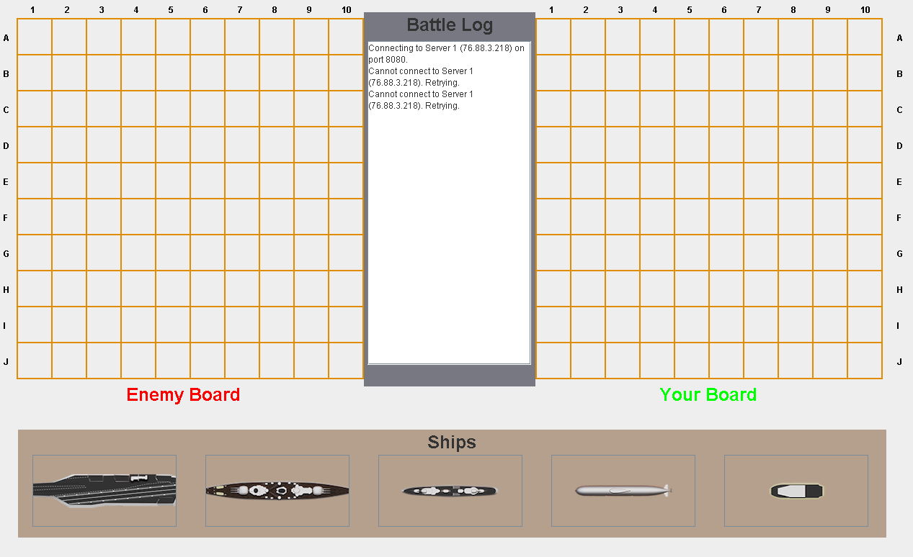

  
  
  

This was me and 3 other friends AP Computer Science final project. We worked together as a team to create a functioning battleship game that ran over a server. My part of the project was developing the user interface, which included custom graphics for the ships. We used default images for the background on the title screen and the ocean (which did not load in the picture, gonna have to look into that) because we ran low on time. We created this over the course of 3 weeks. 
