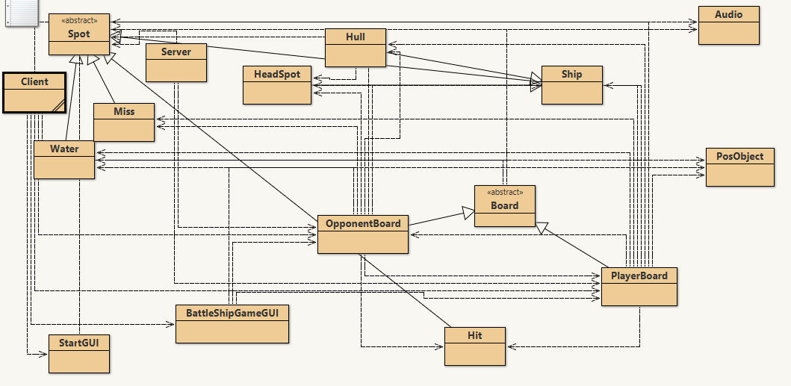

This was me and 3 other friends' AP Computer Science final project. We worked together as a team to create a functioning Battleship game that ran over a server. My part of the project was developing the user interface, which included custom graphics for the ships. We used default images for the background on the title screen and the grid background ocean (which did not load in the picture, gonna have to look into that) because we ran low on time. We created this over the course of 3 weeks. Getting a functional game was a great technical challenge for us, as none of us had any experience with using the tools we were using. We learned on the fly, using github to share code bits and Discord to communicate while we worked. 

Developing the user interface proved to be a challenge, as getting it to work with a server running on a loop required setting up a way to check if an object had updated. We did this with a while loop in the server that would detect that one of the clients had finished making their move. The UI also used custom assets which I digitally modeled and rendered from a top down view. Each one of us had differnet parts of the project, which made testing them relatively complex. We worked as quickly as we could, to account for the bugs we would encounter assembling the code.

This the the interface for BlueJ, the IDE that we used to program the project in. My contributions are the `StartGui` and the `BattleShipGameGui` classes. All the classes vary in complexity and length, with some being relatively simple, containg only a few variables and methods, and others being hundreds of lines of code long. Combining everything with git was a large challenge, as some people had working builds that contained changes to code that had to be resolved. 
