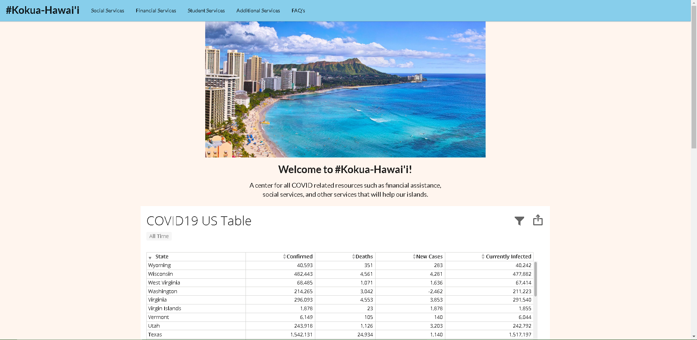
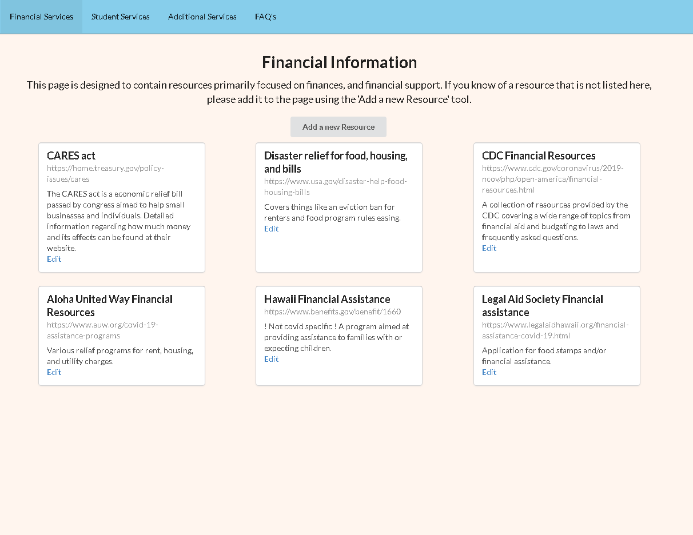

COVID-Kokua, titled Kokua-Hawaii on our website due to domain name acquisition issues, is a series of tools designed to help people living in Hawai'i navigate the various COVID-19 related resources that exist. It was developed as the final project for a software engineering class. A team of four, including myself, were responsible for the website's creation. More information about the website and a user guide can be found at: [https://covid-kokua.github.io/](https://covid-kokua.github.io/). I was responsible for both the `Financial Information` page and the `FAQ` page. All featured information was synthesized on the web, filtered by us, and added to the section most relevant. In addition to financial information, the website provides various information specific to students, related to getting food assistance or COVID-19 helplines. This website was designed to better sort the available resources so that they may be accessed in a helpful way.

