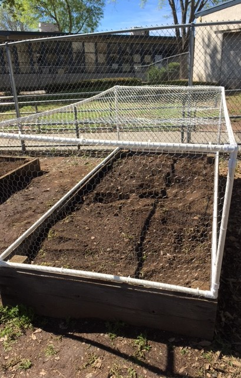

I've been active in the Boy Scouts of America since I was young, and in 2017 I achieved the rank of Eagle Scout. My project for it was to repair and upgrade an elementary school garden to the point of usability by the school with a group of other scouts. This entailed a large clean up and analysis session where we dug out all of the plots, discovering that the sprinkler system was in need of heavy repair. We worked to repair the sprinkler system and then moved on to install anti-rodent wire in the bottoms of the plots. After testing the repaired systems, we filled the plots back in with dirt and cleaned off the surrounding concrete platforms. We then went about repairing some of the tools around the yard, including a wheelbarrow, who's wheel we replaced. That particular task took monumental effort, as the wheel had to be stretched onto the rim. Additionall, we installed a sink and a timer to the sprinkler system. To further protect the gardens, we created wire coverings for all of them in order to prevent the plants from being eaten by mammals. In total, we repaied and upgraded 8 plots, and got the garden to a point of usability. The teachers at that school have grown plants in them every year since.
