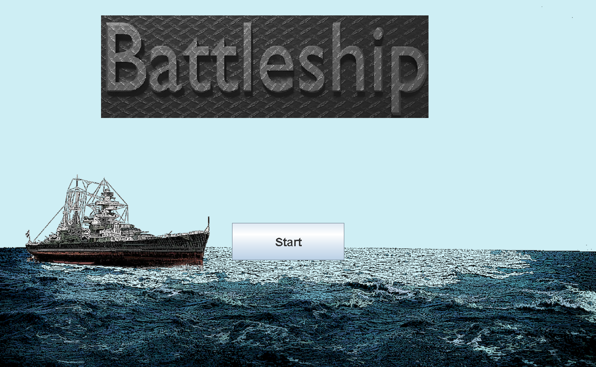
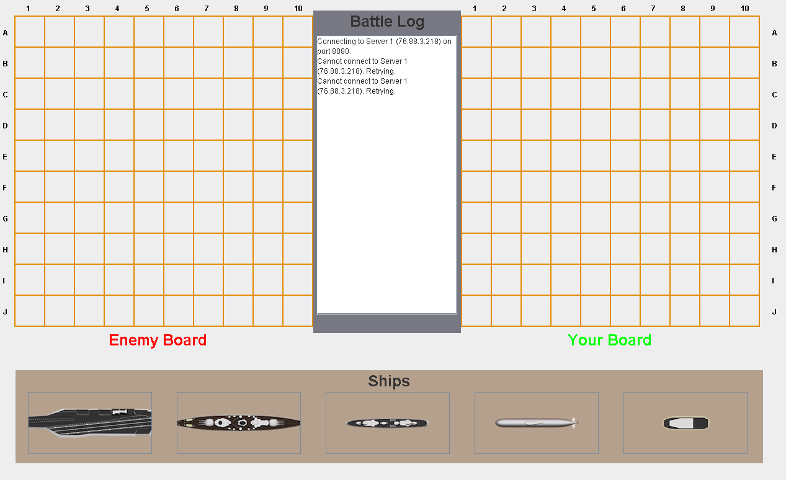
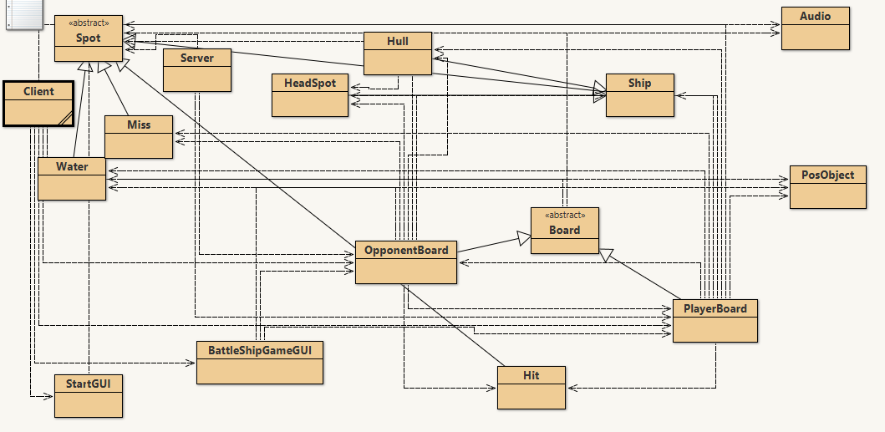

  
  
  

The licorer package is designed to aid in the reading and processing of LI-6800 data files. It uses the R package units to ensure that values recorded with units have the correct scientific units. The focus of the package was facilitating easy data entry to the R programming language in order to speed up data entry and processing while reducing errors as much as possible. I developed this while working at an internship under Dr. Christopher Muir at the university of Hawaii at Manoa.

More information on how it works can be found at [it's git page.](https://github.com/muir-lab/licorer)
