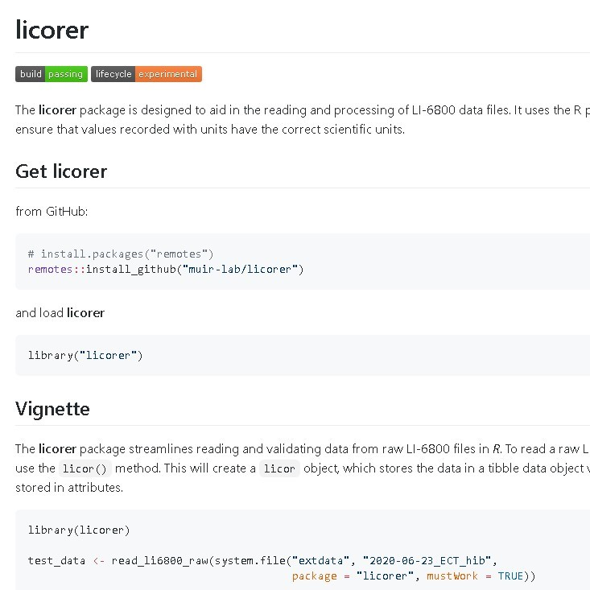

The licorer package is designed to aid in the reading and processing of LI-6800 data files. It uses the R package units to ensure that values recorded with units have the correct scientific units. The focus of the package was facilitating easy data entry to the R programming language in order to speed up data entry and processing while reducing errors as much as possible. I developed this while working at an internship under Dr. Christopher Muir at the university of Hawaii at Manoa. More information on how it works can be found at it's git page:[https://github.com/muir-lab/licorer](https://github.com/muir-lab/licorer), where I wrote a vignette that describes how to use the software (a part of which is pictured above). 

This project mainly had me writing various programming methods to upload and process data into the R programming language. I wrote unit tests for the methods in order to ensure their accuracy and that they gave the expectued results. Most issues with the code were put through github issues, and resolved as they came up. In this project, I greatly improved my ability to use search engines, as I needed to do a significant amount of research both into the data we were using and the techniques we were using to store data in the R programming language. Before this project, I really had no prior experience in R, so learning that language was another aspect of this project. I also further improved my time management skills, as this was a nine to five job. Planning out my day was key in order for me to get tasks done. We would meet to discuss progress on the project daily, and talk about what to do next. Another aspect of the project was liscensing, of which we went with the MIT liscence. 

This project is ongoing, and I am continuing the development of licorer in the fall 2020 semester. Our goal is to get the package to an acceptable point and submit it to CRAN, the database of R packages. 
